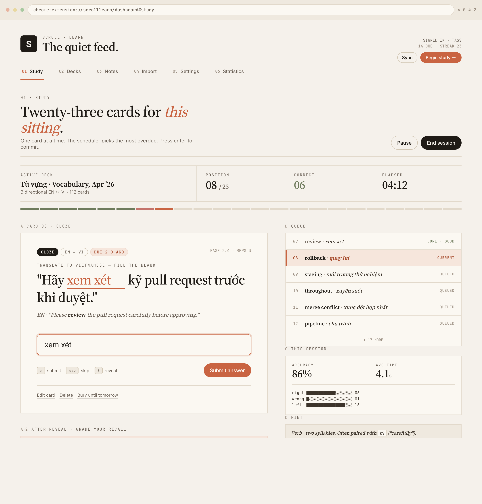
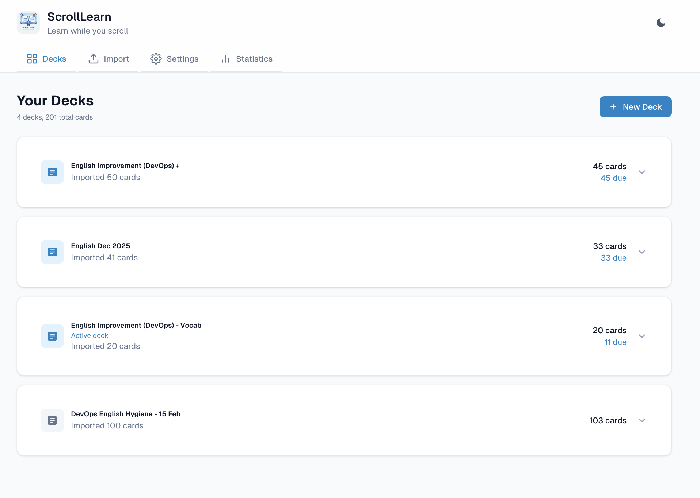
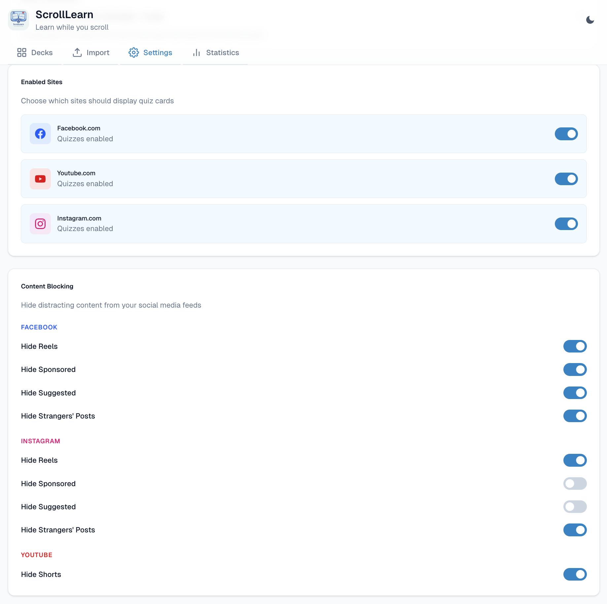
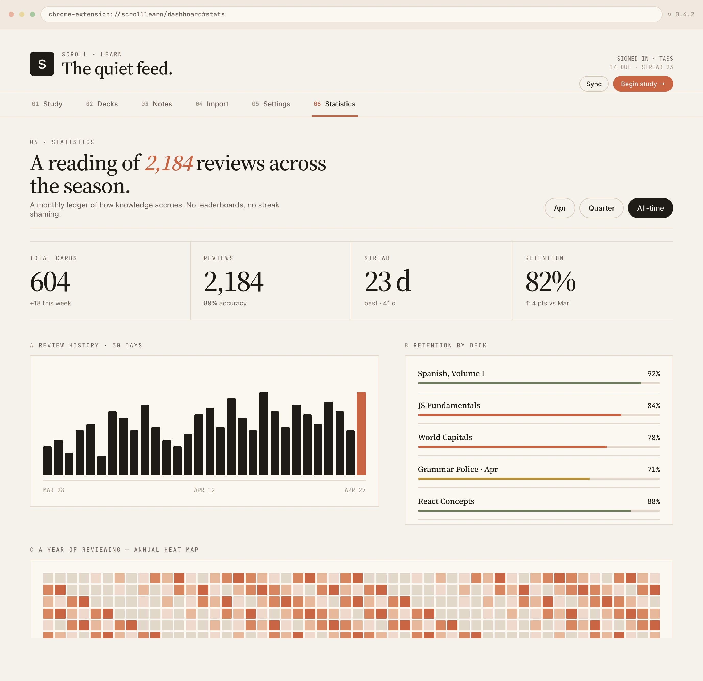
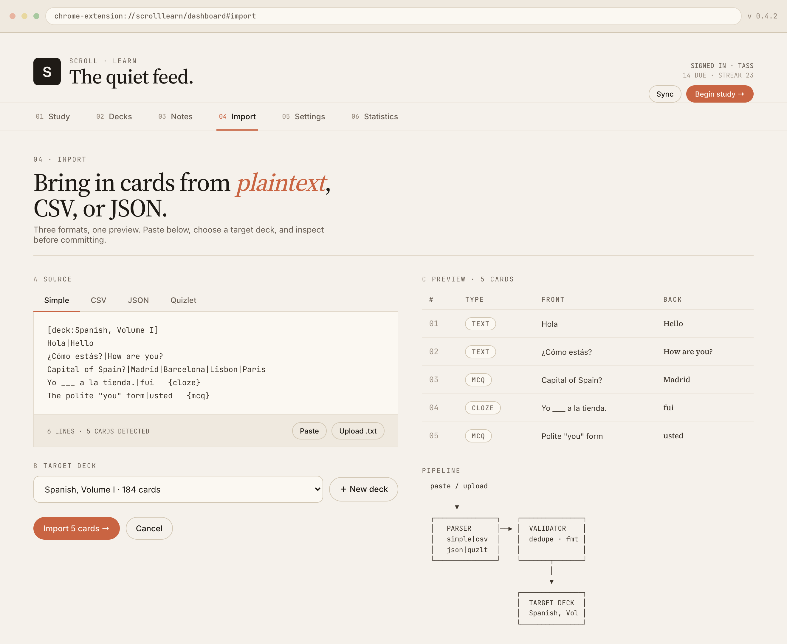
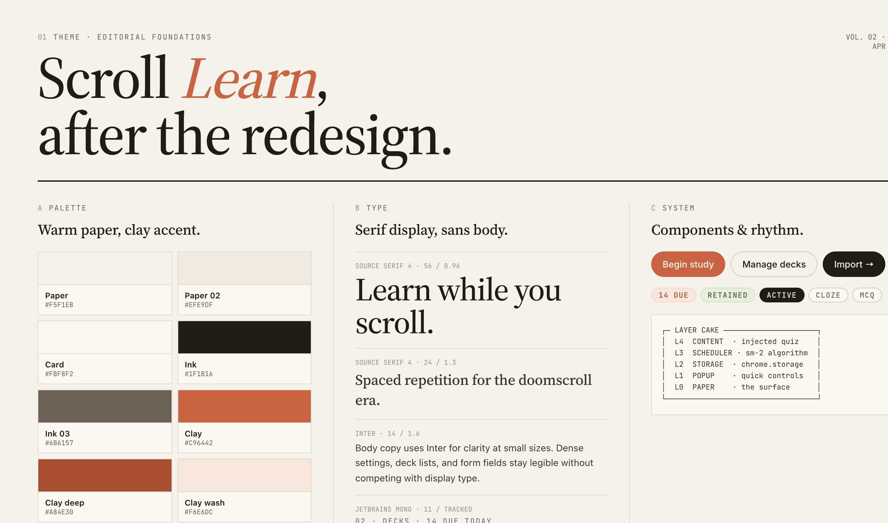
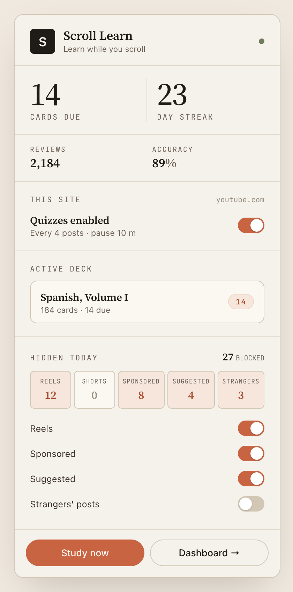
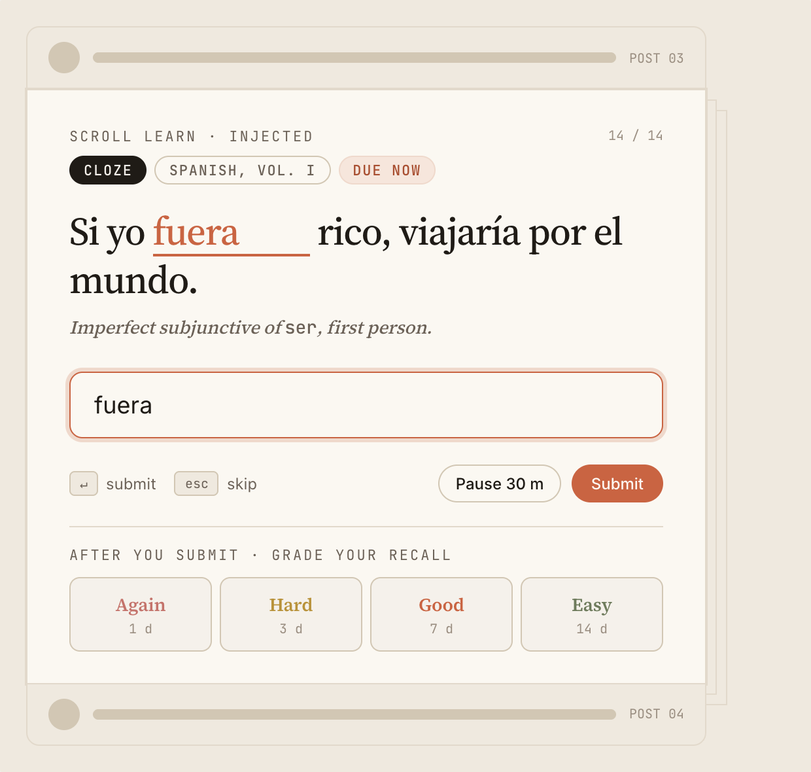

<p align="center">
  
</p>

<h1 align="center">ScrollLearn</h1>

<p align="center">
  <strong>Learn while you scroll</strong> - A Chrome extension that turns social media scrolling into learning time by injecting spaced-repetition flashcard quizzes into your feeds and blocking distracting content.
</p>

<p align="center">
  <a href="https://tasszz2k.github.io/scroll-learn/"><strong>Install page</strong></a> •
  <a href="#features">Features</a> •
  <a href="#screenshots">Screenshots</a> •
  <a href="#installation">Installation</a> •
  <a href="#usage">Usage</a> •
  <a href="#configuration">Configuration</a> •
  <a href="#contributing">Contributing</a>
</p>

<p align="center">
  <a href="https://tasszz2k.github.io/scroll-learn/">tasszz2k.github.io/scroll-learn</a> — one-click installer for macOS + Chrome.
</p>

---

## Features

- **Feed Integration**: Quizzes appear naturally in Facebook, YouTube, and Instagram feeds after scrolling past N posts
- **Spaced Repetition**: SM-2 algorithm for optimal learning retention
- **Multiple Card Types**: 
  - Text (type your answer)
  - Multiple Choice (single select)
  - Multi-Select (check all correct answers)
  - Cloze (fill in the blanks)
  - Audio (listen and respond)
- **Content Blocking**: Hide distracting content from your feeds
  - Facebook: Reels, Sponsored posts, Suggested posts, Strangers' posts
  - Instagram: Reels, Sponsored posts, Suggested posts, Strangers' posts
  - YouTube: Shorts
  - Per-category blocked count with hover breakdown
- **Import Formats**: Quizlet-like simple format, CSV, and JSON
- **Grammar Police Integration**: AI-powered skill that converts [Grammar Police](https://github.com/tasszz2k/GrammarPolice) exports into flashcard decks, grammar reports, exercises, and related knowledge
- **Fuzzy Matching**: Intelligent answer matching with configurable thresholds
- **Progress Tracking**: Statistics, streaks, and review history
- **Retry Practice**: Wrong answers on text/cloze/audio cards require retyping the correct answer to reinforce learning
- **Keyboard Navigation**: Answer quickly with keyboard shortcuts
- **Customizable**: Configure quiz frequency, matching sensitivity, and more

## Screenshots

<table>
  <tr>
    <td align="center" width="50%">
      <br>
      <b>Study Session</b><br>
      <sub>Stand-alone review with bilingual cards, queue, and per-session stats</sub>
    </td>
    <td align="center" width="50%">
      <br>
      <b>Deck Management</b><br>
      <sub>Create, import, and manage flashcard decks with due-card tracking</sub>
    </td>
  </tr>
  <tr>
    <td align="center" width="50%">
      <br>
      <b>Settings Dashboard</b><br>
      <sub>Per-site quiz toggles and granular content blocking options</sub>
    </td>
    <td align="center" width="50%">
      <br>
      <b>Statistics</b><br>
      <sub>Review history, retention by deck, and a year-long heatmap</sub>
    </td>
  </tr>
  <tr>
    <td align="center" width="50%">
      <br>
      <b>Import</b><br>
      <sub>Plaintext, CSV, JSON, and Quizlet formats with live preview</sub>
    </td>
    <td align="center" width="50%">
      <br>
      <b>Theme Foundations</b><br>
      <sub>Warm paper, clay accent, serif display, sans body</sub>
    </td>
  </tr>
  <tr>
    <td align="center" width="50%">
      <br>
      <b>Extension Popup</b><br>
      <sub>Quick stats, site controls, per-category blocked counts</sub>
    </td>
    <td align="center" width="50%">
      <br>
      <b>In-feed Quiz Card</b><br>
      <sub>Cloze, MCQ, and text cards injected directly into your feed</sub>
    </td>
  </tr>
</table>

## Installation

### One-click (recommended)

Visit **<https://tasszz2k.github.io/scroll-learn/>** and click **Download installer**.
You'll get `scroll-learn-installer.zip` — double-click it in Finder to extract
`install.command`, then right-click the extracted file → **Open** (macOS prompts
about unsigned scripts the first time only). Future updates land with a single
click — no terminal, no re-downloading.

See [INSTALL.md](INSTALL.md) for a terminal-only fallback.

### Development Build

1. Clone the repository:
   ```bash
   git clone https://github.com/tasszz2k/scroll-learn.git
   cd scroll-learn
   ```

2. Install dependencies:
   ```bash
   npm install
   ```

3. Build the extension:
   ```bash
   npm run build
   ```

4. Load in Chrome:
   - Open `chrome://extensions/`
   - Enable "Developer mode"
   - Click "Load unpacked"
   - Select the `dist` folder

### Development Mode

For development with hot-reload:

```bash
npm run dev
```

Then load the `dist` folder as an unpacked extension.

## Usage

### Creating Decks and Cards

1. Click the ScrollLearn extension icon or go to the options page
2. In the **Decks** tab, click "New Deck"
3. Click on a deck to expand it, then "Add Card"
4. Choose a card type and fill in the details

### Importing Cards

#### Simple Format (Quizlet-like)
```
Question 1|Answer 1
Question 2|Answer 2
[deck:Spanish]Hola|Hello
Capital of France?|Paris|London|Berlin|Madrid
```

#### CSV Format
```csv
front,back,kind,options,correct
What is 2+2?,4,text,,
Pick the color,Red,mcq-single,Red|Blue|Green,0
```

#### JSON Format
```json
[
  { "front": "Question", "back": "Answer", "kind": "text" },
  { 
    "front": "Pick one", 
    "back": "A", 
    "kind": "mcq-single",
    "options": ["A", "B", "C"],
    "correct": 0
  }
]
```

### Grammar Police Integration

[Grammar Police](https://github.com/tasszz2k/GrammarPolice) is a macOS menubar app that captures grammar corrections and translations as you work across Slack, VS Code, browsers, and other apps. ScrollLearn includes an AI skill that transforms those exports into structured learning materials.

**Pipeline:**

```
Grammar Police (daily use) -> Export JSON -> AI Skill -> Learning Materials -> Import CSV into ScrollLearn
```

**How to use:**

1. Export your correction history from Grammar Police as JSON (see Grammar Police docs for the "Export For Learning" feature)
2. Place the file at `local-test/data/learning_data_YYYY_MM_DD.json`
3. Ask your AI agent (Cursor or Claude) to process it:
   > "Use grammar-police-learn to process `local-test/data/learning_data_2026_03_15.json`"
4. The skill generates the following in `local-test/data/learning_data_YYYY_MM/`:

   | File | Description |
   |------|-------------|
   | `report.md` | Common mistakes, error categories, vocabulary list, month-over-month comparison |
   | `exercises.md` | Spot-the-error, fill-in-the-blank, rewrite, and vocabulary matching exercises |
   | `answer_key.md` | Answers for exercises (kept separate for self-testing) |
   | `related_knowledge.md` | Grammar rules, commonly confused words, professional communication patterns |
   | `grammar_deck.csv` | Flashcard deck for grammar errors (MCQ, text, cloze) |
   | `vocabulary_deck.csv` | Flashcard deck for EN-VN vocabulary (both directions) |

5. Import the CSV files into ScrollLearn via the dashboard's import feature

**What the skill does:**

- Filters out minor-only changes (punctuation, capitalization) and tool misinterpretations
- Independently assesses each correction (Grammar Police uses GPT-4o-mini with limited context, so its corrections are not always accurate)
- Categorizes errors: spelling, verb form, article, preposition, plural, word choice, sentence structure, professional phrasing
- Generates a minimum of 100 flashcard questions across both decks with a mix of ~40% MCQ, ~30% text, ~30% cloze
- Compares with previous months if prior data exists, tracking repeated mistakes and improvements
- Tailored for DevOps/engineering context -- technical terms (CI/CD, PR, ArgoCD, kubectl) are preserved and used in examples

The skill lives at `.agents/skills/grammar-police-learn/` and is symlinked to both `.cursor/skills/` and `.claude/skills/` for use with either AI agent.

### Answering Quizzes

When a quiz appears in your feed:
- **MCQ**: Click an option or press 1-4
- **Text**: Type your answer
- **Cloze**: Fill in each blank
- Press **Enter** to submit
- Press **Escape** to skip (snooze for 10 minutes)
- Click **Pause 30m** to pause quizzes on the site

### Keyboard Shortcuts

| Key | Action |
|-----|--------|
| 1-4 | Select MCQ option |
| Enter | Submit answer |
| Escape | Skip card (snooze 10 min) |

## Configuration

In the **Settings** tab:

- **Quiz Behavior**
  - Show after N posts (1-20)
  - Pause after quiz (0-60 minutes)

- **Enabled Sites**
  - Toggle Facebook/YouTube/Instagram

- **Content Blocking** (per platform)
  - Facebook: Hide Reels, Sponsored, Suggested, Strangers' Posts
  - Instagram: Hide Reels, Sponsored, Suggested, Strangers' Posts
  - YouTube: Hide Shorts

- **Answer Matching**
  - Characters to ignore
  - Case sensitivity
  - Fuzzy matching thresholds

## Architecture

```
src/
  background/       # Service worker, SM-2 scheduler
  content/          # Feed detection, quiz injection
  dashboard/        # React dashboard UI
  popup/            # Extension popup for quick access
  common/           # Shared types, storage, parsers
```

### Key Components

- **Background Service Worker**: Handles card scheduling, storage, and messaging
- **Content Scripts**: Detect feed posts, inject quiz UI, and block unwanted content
- **Content Blocker**: Hides Reels/Shorts, Sponsored, Suggested, and Strangers' posts using CSS injection, MutationObserver, and periodic scanning
- **Dashboard**: React app for deck/card management, import, and settings
- **Popup**: Quick access to stats, content blocking toggles, and per-category blocked counts

### SM-2 Scheduling

Cards are scheduled using the SM-2 algorithm:
- **Grade 0 (Again)**: Reset to 1 day, reduce ease
- **Grade 1 (Hard)**: Small interval, slight ease reduction
- **Grade 2 (Good)**: Standard progression
- **Grade 3 (Easy)**: Bonus interval, increase ease

## Development

### Project Structure

```
scroll-learn/
  src/
    background/     # Service worker
    content/        # Content scripts
    dashboard/      # React dashboard
    common/         # Shared utilities
    popup/          # Extension popup
    styles/         # CSS files
  tests/            # Unit tests
  samples/          # Sample decks
  docs/             # Documentation and sample files
  public/           # Static assets
  .agents/skills/   # AI agent skills (symlinked to .cursor/skills/ and .claude/skills/)
  local-test/data/  # Grammar Police exports and generated learning data
```

### Scripts

```bash
npm run dev       # Start development server
npm run build     # Production build
npm run test      # Run tests
npm run lint      # Lint code
```

### Testing

```bash
npm run test
```

Tests cover:
- Parser functions (normalizeText, parseSimpleLine, etc.)
- SM-2 scheduler (grade calculations, intervals)

### Extending to New Sites

1. Create a new detector in `src/content/`:
   ```typescript
   export const newSiteDetector: DomainDetector = {
     name: 'NewSite',
     domain: /newsite\.com$/i,
     getPostSelector: () => 'article',
     getFeedContainer: () => document.querySelector('main'),
     isValidPost: (el) => /* validation */,
     getInsertionPoint: (post) => post,
     getPostId: (post) => /* unique ID */,
   };
   ```

2. Add to content script domain detection
3. Update manifest host_permissions

## Sample Decks

Import sample decks from the `samples/` or `docs/samples/` folders:
- `language-deck.json` - Spanish basics
- `programming-deck.json` - Programming concepts
- `spanish-basics.txt` - Simple format Spanish vocabulary
- `javascript-fundamentals.txt` - JavaScript quiz questions
- `world-capitals.csv` - Geography flashcards (CSV format)
- `react-concepts.json` - React concepts (JSON format)

## Tech Stack

- **Framework**: React + TypeScript
- **Build**: Vite + @crxjs/vite-plugin
- **Styling**: Tailwind CSS
- **Storage**: Chrome Storage API
- **Testing**: Vitest

## Contributing

1. Fork the repository
2. Create a feature branch
3. Make your changes
4. Run tests: `npm run test`
5. Submit a pull request

## License

MIT License - See LICENSE file for details.

## Roadmap

- [ ] Anki .apkg import/export
- [ ] Cloud sync
- [ ] More site support (Twitter/X, Reddit)
- [ ] Image cards
- [ ] Deck sharing
- [ ] Spaced repetition statistics visualization
